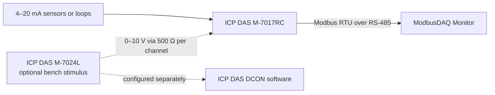

# ModbusDAQ Monitor

ModbusDAQ Monitor is a Windows desktop application for acquiring, visualizing, calibrating, and logging four 4–20 mA channels from an ICP DAS M-7017RC module over Modbus RTU. It was developed and bench-tested as an undergraduate engineering project.

> **Project status:** academic, bench-validated prototype. It is not a hard real-time system, a safety instrumented system, or production-ready industrial software.


## What the project demonstrates

- Four-channel 4–20 mA acquisition through an RS-485/serial connection.
- An English-language MFC interface designed for an international portfolio audience.
- A Modbus RTU client that validates the slave address, function code, byte count, CRC, and exception responses.
- Explicit measurement validity: communication failures are recorded as errors rather than converted into plausible `0.0 mA` samples.
- Per-channel two-point linear calibration, applied once to each valid raw measurement.
- Configurable alarm thresholds, warning bands, and hysteresis.
- Bounded measurement history, charting, CSV export, continuous CSV logging, and a hardware-free simulation mode.
- Separation between the MFC user interface, acquisition services, protocol logic, serial transport, and testable domain logic.
  


## Bench setup and system boundary

The application reads four input channels of the **M-7017RC**. During the original bench validation, four 0–10 V outputs from an **M-7024L** were passed through 500 Ω resistors, producing equivalent 4–20 mA test signals over the 2–10 V portion of the range. The M-7024L was configured separately with ICP DAS DCON software.

**The application does not control the M-7024L and does not implement DCON output commands.** This boundary avoids presenting the test signal source as part of the acquisition application's control path.



See [Hardware setup](docs/hardware-setup.md) for the connection boundary and bring-up checklist.

## Engineering highlights

The refactor turns the original thesis application into a portfolio-oriented codebase without hiding its prototype status:

- `Win32SerialPort` owns the Windows serial handle and performs bounded, exact-length reads.
- `ModbusRtuClient` is independent of MFC and consumes an `ISerialTransport` abstraction.
- A single in-flight background request keeps serial polling and multi-sample calibration off the MFC user-interface thread.
- `MeasurementBatch` carries raw values, calibrated values, validity, timestamps, and communication status together.
- `CalibrationModel` and `AlarmEvaluator` contain pure C++ domain rules that are separate from dialog event handlers.
- `CsvLogger` moves file writes off the user-interface path while preserving failed communication attempts as status rows with empty channel values.

The detailed design is documented in [Architecture](docs/architecture.md).

## Repository layout

```text
ModbusDAQMonitor.sln
src/
└── ModbusDAQMonitor/
    ├── domain/       Measurement, calibration, alarms, and bounded history
    ├── protocol/     Modbus RTU request/response handling
    ├── services/     Acquisition orchestration and CSV output
    ├── simulation/   Deterministic hardware-free signal source
    ├── transport/    Serial abstraction and Win32 implementation
    ├── ui/           MFC dialogs and presentation logic
    └── res/          Windows resources and application icon
docs/
├── architecture.md
├── calibration-and-alarms.md
└── hardware-setup.md
```

## Build requirements

- Windows 10 or Windows 11.
- Visual Studio 2022 or newer with the **Desktop development with C++** workload.
- MSVC v143 build tools.
- C++ MFC for the selected x86/x64 toolset.
- A Windows 10 or Windows 11 SDK.

### Build in Visual Studio

1. Open `ModbusDAQMonitor.sln`.
2. Select `x64` and either `Debug` or `Release`.
3. Choose **Build > Build Solution**.

The project targets C++17 and links against the shared MFC runtime. A machine that runs the compiled Release executable may also need the matching Microsoft Visual C++ Redistributable.

### Build from a Developer PowerShell

```powershell
msbuild .\ModbusDAQMonitor.sln /m /p:Configuration=Release /p:Platform=x64
```

## Hardware configuration assumptions

The current acquisition path uses:

- Modbus RTU function `0x03` (Read Holding Registers).
- Four registers starting at address `0`.
- A conversion of `1000` register units per milliamp.
- Serial framing of 8 data bits, no parity, and 1 stop bit.
- A selectable Modbus slave ID in the valid range `1–247`.

The application currently uses `9600 baud`. Configure the M-7017RC and the selected COM port consistently. The register addresses and scaling are setup-specific assumptions and must be checked against the module configuration and manufacturer documentation before adapting the software to another device or range.

## Quick start

1. Configure and verify the M-7017RC with the manufacturer's tools and documentation.
2. Connect the PC to the module's RS-485 bus through the appropriate interface.
3. Start the application, select the COM port, and enter the module's slave ID.
4. Start acquisition and verify the displayed current against a known input.
5. Use simulation mode first when hardware is unavailable or when checking the user interface.
6. Perform a two-point calibration only with stable, known current references. See [Calibration and alarms](docs/calibration-and-alarms.md).

## Bench validation

The thesis prototype was exercised on a physical bench with four analogue input channels, an M-7017RC acquisition module, and an M-7024L used as a separately controlled voltage stimulus through four 500 Ω resistors. This validates the project concept and end-to-end workflow on that setup; it does not constitute environmental, EMC, long-duration, metrology, or safety certification.

## Automated tests

The portable C++17 test target covers calibration, alarm hysteresis, bounded history, simulation, CSV error separation, the Modbus CRC, and protocol response validation through a fake serial transport. It does not require MFC or physical hardware.

The same suite runs on every push and pull request through the Windows GitHub Actions workflow.

```powershell
cmake -S .\tests -B .\tests\build
cmake --build .\tests\build --config Release
ctest --test-dir .\tests\build -C Release --output-on-failure
```

## Known limitations

- Windows-only MFC desktop interface.
- Polling is scheduled by the UI timer and executed by a single background request worker; it is not deterministic real-time acquisition.
- Serial parameters, register mapping, and scaling are not yet fully configurable.
- Calibration coefficients are session state unless persistence is added by a future change.
- No automatic control or configuration of the M-7024L.
- No claim of fail-safe behavior, redundant acquisition, or certified measurement accuracy.

## Contributing

See [CONTRIBUTING.md](CONTRIBUTING.md) for build checks, code boundaries, and the hardware-change checklist.
