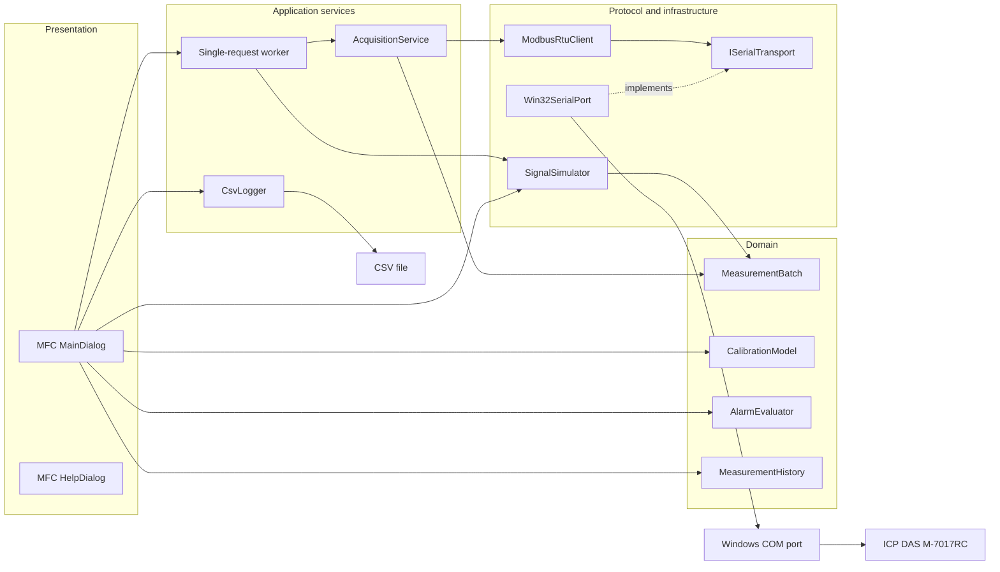

# Architecture

## Design intent

ModbusDAQ Monitor separates device communication, measurement rules, persistence, simulation, and MFC presentation. The separation makes the engineering decisions visible and reduces the risk of coupling a communication fault to an incorrect user-interface value.

This remains a desktop prototype: the design improves correctness and maintainability, but a background worker and timer-driven cadence do not turn Windows polling into a deterministic real-time system.

## Component view



The optional M-7024L bench source is outside this software architecture. It is controlled independently through DCON software; in the thesis bench its voltage outputs were converted through 500 Ω resistors before reaching the M-7017RC inputs.

## Source responsibilities

| Area | Responsibility | Must not depend on |
| --- | --- | --- |
| `ui/` | Dialog controls, user commands, chart rendering, and presentation | Device-specific frame parsing |
| `domain/` | Measurement state, two-point calibration, alarm state, and bounded history | MFC, Win32 serial APIs |
| `services/` | Acquisition orchestration and CSV logging/export | Dialog controls |
| `protocol/` | Modbus RTU requests, responses, CRC, and protocol validation | MFC |
| `transport/` | Serial-port interface and Win32 handle ownership | Measurement presentation |
| `simulation/` | Repeatable four-channel samples without physical hardware | Serial transport |
| `res/` | Icon and Windows resource assets | Business logic |

## Acquisition path

```mermaid
sequenceDiagram
    participant Timer as UI timer
    participant Worker as Request worker
    participant A as AcquisitionService
    participant M as ModbusRtuClient
    participant S as Win32SerialPort
    participant D as M-7017RC
    participant UI as MFC UI thread

    Timer->>Worker: Schedule if no request is in flight
    Worker->>A: Poll four channels
    A->>M: ReadHoldingRegisters(slave, 0, 4)
    M->>S: Purge and write function 0x03 request
    S->>D: Modbus RTU frame
    D-->>S: Response frame
    M->>S: Read exact header and remaining bytes
    M->>M: Validate slave, function, byte count, CRC, exception
    M-->>A: Registers or typed communication error
    A-->>Worker: Timestamped MeasurementBatch
    Worker-->>UI: Post completion message

    alt Valid batch
        UI->>UI: Apply calibration once
        UI->>UI: Evaluate alarms and update history
        UI->>UI: Enqueue CSV row
    else Communication failure
        UI->>UI: Report status; do not synthesize 0.0 mA
    end
```

The current register conversion is:

```text
raw current [mA] = register value / 1000
```

This is an application/setup assumption, not a general Modbus rule. A new target device should receive its own register map and conversion policy rather than changing the UI code.

## Measurement model

`MeasurementBatch` is the unit passed between acquisition, simulation, history, alarms, and logging. It contains:

- one timestamp for the poll;
- four `ChannelMeasurement` values;
- raw and calibrated current in milliamps;
- per-channel validity;
- a communication error category;
- a Modbus exception code when applicable.

The communication status is deliberately separate from the numeric value. A timeout, CRC failure, unexpected slave, unexpected function, byte-count mismatch, closed port, transport failure, or Modbus exception cannot silently become a valid current sample.

## Calibration and alarm rules

`CalibrationModel` stores an independent two-point linear transform for each channel. Uncalibrated channels use the raw value unchanged. The UI applies this transform before history, alarm evaluation, or CSV output, so a stored calibrated value is not calibrated a second time.

`AlarmEvaluator` is stateful per channel. It uses minimum/maximum limits, an inner warning band, and hysteresis to prevent repeated transitions when a signal moves around a boundary. Invalid communication samples are not electrical alarms and should not be passed to the evaluator.

The formulas and state transitions are documented in [Calibration and alarms](calibration-and-alarms.md).

## Timing and concurrency

- The MFC timer schedules at most one background request at a time; missed timer ticks do not create a backlog.
- Serial polling and ten-sample calibration capture run outside the MFC thread, then post results back for all UI updates.
- Serial request/response work is synchronous from the caller's perspective and has bounded reads/timeouts.
- `MeasurementHistory` has a fixed capacity, so a long session does not grow memory without limit.
- `CsvLogger` owns a worker thread and queue. File I/O is separated from the presentation path, and shutdown joins the worker before closing the file.

Windows scheduling, serial latency, and the MFC message loop mean that the selected interval is a target polling cadence, not a guaranteed sampling deadline.

## Extensibility seams

- Implement another `ISerialTransport` to test Modbus parsing or support a different transport boundary.
- Add a device profile above `ModbusRtuClient` for another register map or scaling rule.
- Test `CalibrationModel`, `AlarmEvaluator`, and `MeasurementHistory` without MFC or hardware.
- Replace `SignalSimulator` with captured test vectors for repeatable regression scenarios.
- Replace the per-request worker with a persistent scheduler if stricter cadence control or cooperative cancellation is required.

Any such change should preserve the central invariant: **only valid samples enter the calibrated measurement and alarm path**.
