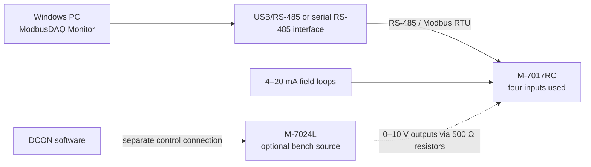

# Hardware setup

## Scope and safety

This guide describes the topology used by the academic bench prototype. It is not a substitute for the ICP DAS manuals, a wiring design, or an electrical safety assessment.

Disconnect power before changing wiring. Confirm supply voltage, channel mode, loop polarity, isolation, grounding, and allowable current against the exact module revision. Use suitable protection and an appropriately rated RS-485 interface in an industrial installation.

## Equipment

Required for physical acquisition:

- Windows PC running ModbusDAQ Monitor;
- RS-485 interface exposed as a Windows COM port;
- ICP DAS M-7017RC analogue input module;
- one to four correctly powered 4–20 mA loops or current sources;
- module and loop power supplies suitable for the hardware configuration.

Used for the original bench validation, but not required by the application:

- ICP DAS M-7024L analogue output module;
- ICP DAS DCON software to command the M-7024L independently;
- four 500 Ω resistors used in the thesis bench to convert 2–10 V into 4–20 mA;
- a suitable reference meter when measurement traceability matters.

## Connection boundary

The solid path is the application under test. The dashed M-7024L path is only a way to generate bench stimuli. ModbusDAQ Monitor neither configures nor drives the M-7024L. In the documented thesis bench, each used voltage output drove a 500 Ω resistor so that 2 V corresponded to 4 mA and 10 V to 20 mA by Ohm's law.

## Wiring checklist

Use the manufacturer diagrams for terminal numbers and channel-specific wiring. Before applying power, verify:

1. The M-7017RC supply and the 4–20 mA loops use the required voltage and polarity.
2. Each channel is configured for the intended current input mode.
3. Current-loop return paths follow the selected isolated/non-isolated wiring diagram.
4. RS-485 data lines use the correct polarity throughout the bus.
5. Biasing, termination, shielding, and protective earth are applied only as required for the actual cable length and topology.
6. All device addresses on the bus are unique.
7. The M-7024L voltage range, resistor value/tolerance, dissipation, wiring, and M-7017RC input circuit match the documented conversion before power is applied.

Do not infer terminal assignments from this repository. Module variants and channel modes can differ.

## Serial and Modbus settings

The current application expects:

| Setting | Application value |
| --- | --- |
| Baud rate | 9600 |
| Data bits | 8 |
| Parity | None |
| Stop bits | 1 |
| Modbus function | `0x03`, Read Holding Registers |
| First register | `0` |
| Register count | `4` |
| Slave ID | User-selected, `1–247` |

Set the M-7017RC to matching communication parameters. If the module is configured differently, change the device configuration or update the software deliberately; a baud/framing mismatch normally appears as a timeout or invalid response.

The software divides each returned register by `1000` to obtain milliamps. Verify this scaling against the M-7017RC mode and register representation used on your bench.

## Bring-up procedure

1. With the acquisition application closed, use the manufacturer's tools to confirm that the M-7017RC responds at the intended serial settings and slave ID.
2. Disconnect other programs that may still own the same COM port.
3. Launch ModbusDAQ Monitor and use simulation mode to check the UI workflow without hardware.
4. Disable simulation, select the correct COM port, and enter the M-7017RC slave ID.
5. Start with one stable current source on one channel.
6. Compare the raw displayed value with the source/reference measurement.
7. Repeat for the remaining channels and across at least two points in the operating span.
8. Start logging only after communication and units have been verified.

## Using the M-7024L as a bench stimulus

1. Configure the M-7024L through DCON software, not through ModbusDAQ Monitor.
2. Reproduce the thesis conversion only after verifying the 500 Ω resistor value, tolerance, power rating, connections, and both module manuals.
3. Apply a stable first reference voltage/current and allow the reading to settle.
4. Capture the first calibration point in the application.
5. Apply a sufficiently different second reference current and capture the second point.
6. Verify one or more intermediate values that were not used to calculate the calibration.

A commanded output value is not automatically a traceable reference. Use a calibrated meter if accuracy claims are required.

## Troubleshooting

| Symptom | Checks |
| --- | --- |
| COM port cannot be opened | Correct port, cable/adapter driver, and no other application holding the port |
| Repeated timeout | Baud/framing, slave ID, RS-485 polarity, module power, and bus termination |
| CRC or malformed-response errors | Noise, grounding/shielding, cable length, duplicate addresses, and serial settings |
| Stable but incorrectly scaled values | Input range/mode, register map, signed/unsigned representation, and the `1000 units/mA` assumption |
| One channel is invalid | That loop's polarity, return path, channel mode, and source compliance |
| Values jump when equipment is connected | Shared grounds, supply coupling, shielding, and isolated/non-isolated wiring choice |

Treat communication errors separately from electrical alarms. A missing Modbus response is not a measured `0 mA` signal.
